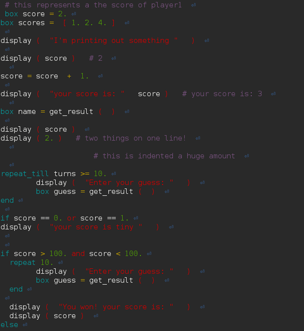

# Senior project

A repo to hold the code from the programing language.

My proposal can be seen [ here ](https://github.com/justgage/senior-project/blob/master/preposal.md)

Here's a screenshot of the tokenizer (old now)


# The Interpeter

The interpeter is found under the `ocaml-parser/src/` directory. You can comile it with `make` considering you have OCaml, opam, and the packages `core` installed. 

You can run an example by doing `./cog -f simple.cog`

Here's some example code:

```
func add l r = l + r;
func subtract l r = add(l, (- r));

box left = 12;
box right = 100;

display(left, " minus ", right, " is ", subtract(left,right));
```
